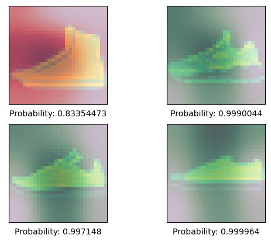
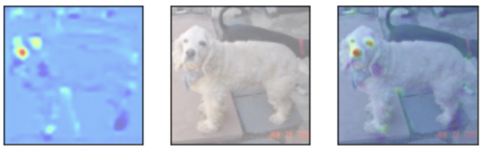
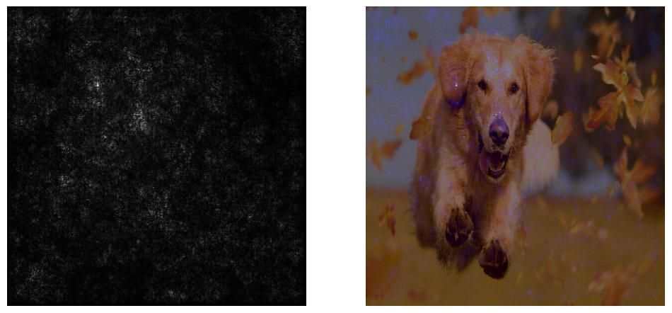

# Class_Activation_Map (Tensorflow)
This project includes three scripts that describe how to extract "Activation Map" to explain the performance of the neural network

1. `Class_Activation_Map_MNIST.ipynb` uses [Fashion MNIST dataset](https://github.com/zalandoresearch/fashion-mnist) dataset. 
The model is built by several Conv blocks and the validation accuracy reaches 85% after a few epochs. The result:

where the darker areas in backgound imply more attention the neural network paid. 

2. `Class_Activation_Map_CatandDogs.ipynb` uses [Cats vs Dogs](https://www.tensorflow.org/datasets/catalog/cats_vs_dogs) in the tensorflow_datasets, which is a binary classification problem.  
The validation accuracy reaches 0.87 after 25 epochs and a sample result is shown as, 

Highlighted areas such as eyes and nose play an important role in classifying objects using neural networks

3. `Saliency_Map.ipynb` uses [Inception V3 model](https://arxiv.org/abs/1512.00567) to plot saliency maps, which also tells us what parts of the image the model is focusing on when making its predictions. 
- The main difference is in saliency maps, we are just shown the relevant pixels instead of the learned features. 
- one could generate saliency maps by getting the gradient of the loss with respect to the image pixels. 
- changes in certain pixels that strongly affect the loss will be shown brightly in your saliency map.

